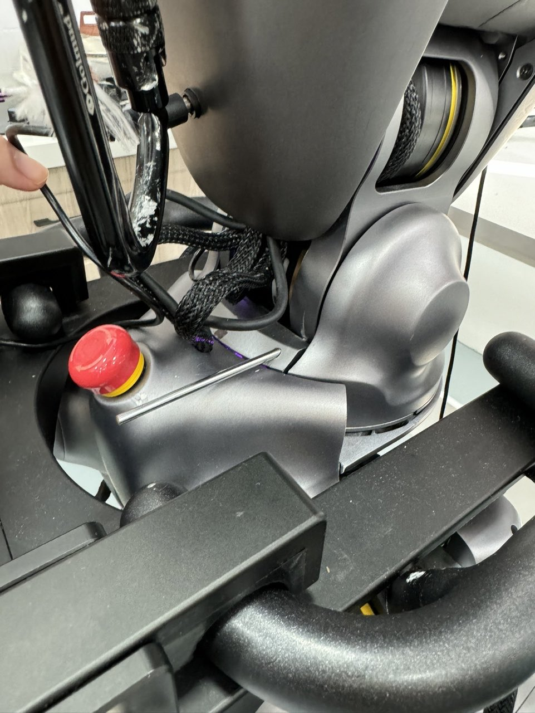
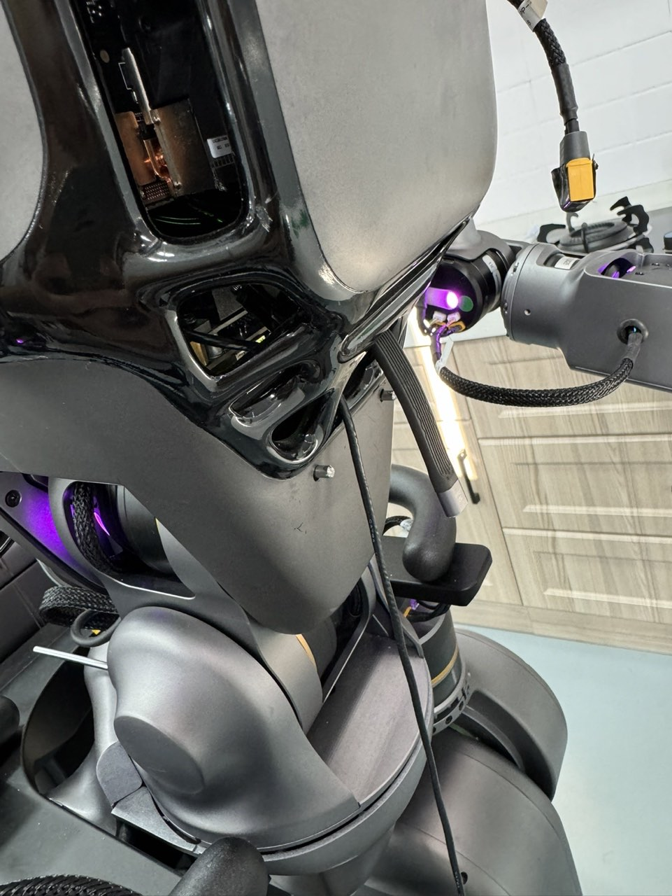
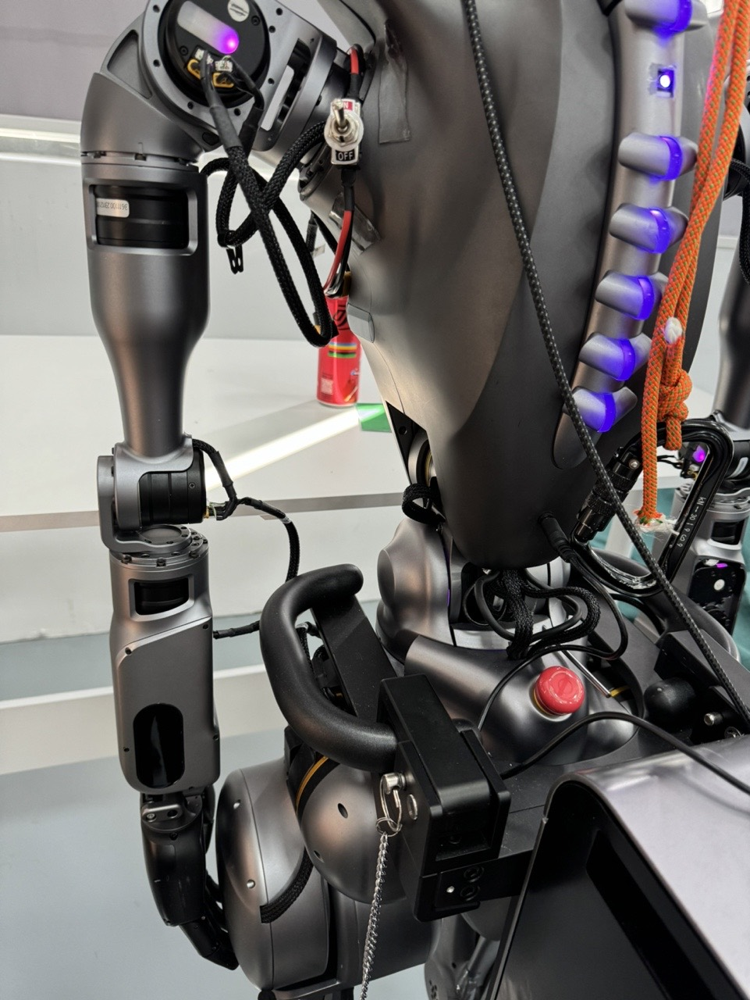
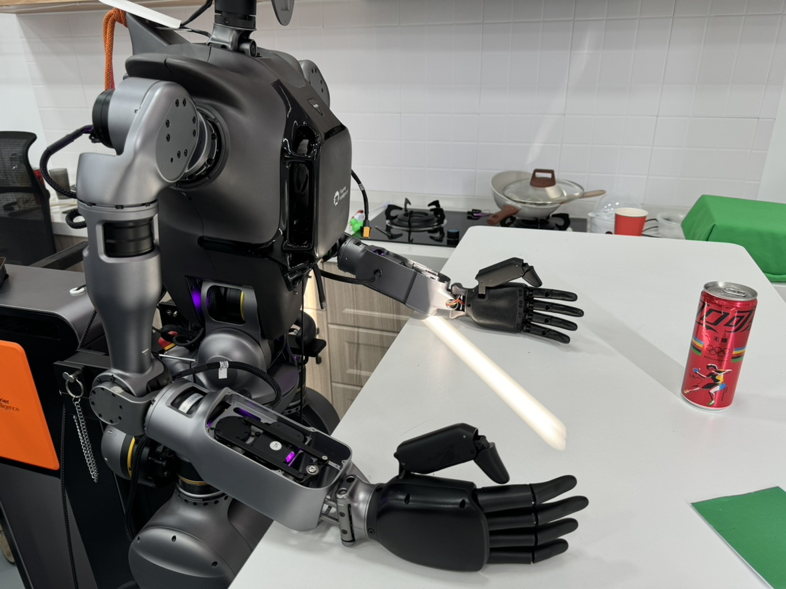

# teleoperation


## 🚀 Environment Setup

1. Clone the official repository

```bash
git clone https://github.com/FFTAI/teleoperation.git
```

2. Create a virtual environment and install the required packages

```bash
conda create -n teleop python==3.11.10
conda activate teleop
pip install -e '.[fourier,realsense]' # add other optional dependencies if needed
pip uninstall typing # this is a workaround, vuer installs typing, but it is obsolete in newer python versions
```

3. (Optional) Install ZED SDK

    The ZED setup composes with two parts:

    - Install the ZED SDK:
        ZED SDK coould be installed from the [official website](https://www.stereolabs.com/en-sg/developers/release). Please select the version that matches your operating system.

    - Install the ZED Python API

        The ZED python API could be installed with following command:

        ```bash
        # Activate the your virtual environment
        conda activate teleop

        # install Python (x64 version) and the pip package manager. Then install the dependencies via pip in a terminal.
        python -m pip install cython numpy opencv-python pyopengl

        # Install ZED python API
        cd /usr/local/zed/
        python get_python_api.py
        ```

4. (Optional) Install Intel RealSense Setup
    For setting up Intel RealSense, there are two steps that need to be done:
    - Install the librealsense for using realsense with [official instructions](https://github.com/IntelRealSense/librealsense/blob/master/doc/distribution_linux.md#installing-the-packages)
    - Cheking the serial number of the camera and update the `realsense.yaml` file in the `camera` directory inside `config` directory.
    > [!NOTE] If you are using multi realsense cameras, you need to update the `realsense_multi.yaml` file with the serial number of each camera.

5. (Optional) Install DepthAI library for Oak camera
    The depthai library could be installed with following command:
    ```bash
    sudo wget -qO- https://docs.luxonis.com/install_dependencies.sh | bash
    ```

6. Setup `fourier-grx`

The fourier GR series robots are controlled by the `fourier-grx` package. The `fourier-grx` package is only available for Python 3.11. Thus, we suggest you to create a new virtual environment with Python 3.11 and install the package in the new environment. For more information, please refer to the [official Fourier GRX Documentation](https://fftai.github.io/fourier-grx-client)

```bash
conda create -n grx python==3.11
conda activate grx
pip install fourier-grx==1.0.0a19
cd ./server_config
grx run ./gr1t2.yaml --namespace gr/daq
```

Then in another terminal, you can run the following command to do the initial calibration, make sure the robot is in the initial position.

```bash
conda activate grx
grx calibrate
```

After the calibration, there should be a `sensor_offset.json` file in the `./server_config` directory.

## 👓 Setup VisionPro

The VisionPro setup is the same as the original [OpenTeleVision](https://github.com/OpenTeleVision/TeleVision/blob/main/README.md).

### 🌐 Local Machine Connection

Apple restricts WebXR access on non-HTTPS connections. To test the application locally, you need to set up a self-signed certificate and install it on the client device. Here's what you'll need:

1. An Ubuntu machine.
2. A router.
3. VisionPro connected to the same network with the Ubuntu machine.

> [!NOTE]
> Please ensure that both the VisionPro and the Ubuntu machine are on the same network.

### 🔐 Self-Signed Certificate

We'll be using `mkcert` to create a self-signed certificate. and `mkcert` is a simple tool for making locally-trusted development certificates. It requires no configuration. Here's how to set it up:

1. Please follow the instructions on the [official website](https://github.com/FiloSottile/mkcert) to install `mkcert`.

2. check the internet IP information with

```bash
ifconfig | grep inet
```

3. Creating the certificate with `mkcert`, make sure to put the IP address of your computer in the command

```bash
mkcert -install && mkcert -cert-file cert.pem -key-file key.pem {Your IP address} localhost 127.0.0.1
```

  **example usage:**

```bash
mkcert -install && mkcert -cert-file cert.pem -key-file key.pem 192.168.1.100 your-computer.local localhost 127.0.0.1
 ```

 > [!IMPORTANT]
 > `192.168.1.100` is a placeholder IP address just for example, please replace it with your actual IP address

 > [!TIP]
 > For Ubuntu machines, you can use the zeroconf address instead of the IP address for additional convenience. The zeroconf address is usually `$(hostname).local`. You can find it by running `echo "$(hostname).local"` in the terminal.

4. Turn on firewall setup

```bash
sudo iptables -A INPUT -p tcp --dport 8012 -j ACCEPT
sudo iptables-save
sudo iptables -L
```

  or setup firewall with `ufw`

```bash
sudo ufw allow 8012
```

5. install ca-certificates on VisionPro

```bash
mkcert -CAROOT
```

  Copy the `rootCA.pem` file to the VisionPro device through the Airdrop.

  Settings > General > About > Certificate Trust Settings. Under "Enable full trust for root certificates", turn on trust for the certificate.

  Settings > Apps > Safari > Advanced > Feature Flags > Enable WebXR Related Features

  > [!NOTE]
  > For some general setting up questions on visionpro could be found in the [VisionPro Setting FAQ](./visionpro_setting_FAQ.md).

6. Certicates path
  Place `key.pem` and `cert.pem` into the `certs` folder to make sure the certificates are accessible by scripts.

7. open the browser on Safari on VisionPro and go to <https://192.168.1.100:8012?ws=wss://192.168.1.100:8012>

  You will see the message "Your connection is not secure" because we are using a self-signed certificate. Click "Advanced" and then "proceed to website". You will be prompted to accept the certificate.

  Also, since the python script is not running, the browser will show a message "Safari cannot open the page because the server could not be found.". This is expected behavior. **Refresh the page after running the python script** and you will see the VR session.

8. Run the python script on the Ubuntu machine. Please see the [Usage](#usage) section for more details.

> [!NOTE]
> You should be able to use this with Oculus Quest 2 as well. The setup process is more involved, but you should be able to stream using adb follwoing [this issue](https://github.com/OpenTeleVision/TeleVision/issues/12#issue-2401541144).

## 🕹️ Usage 
### Fourier GRX system

> [!TIP]
> You could use the pins to help you to lock the robot's waist if you don't want to use the waist. However, make sure you are calling use `use_waist=false` in the command. Otherwise, the robot's waist will be broken. The pins are located in the image below:




### Start up the GRX server

```bash
cd ./server_config
grx run ./gr1t2.yaml --namespace gr/daq
```

Before using real robot, make sure the robot is in the initial position. Also, if you are first time using the robot, you need to do the calibration first. For GRX system, you can use the `grx calibrate` command to do the initial calibration. The initial position of the robot looks like this:



### Run the teleoperation script

We manage the config with [Hydra](https://hydra.cc/docs/intro/). You can select config files and override with hydra's [override syntax](https://hydra.cc/docs/advanced/override_grammar/basic/).
By default, the script uses the `teleop_gr1` config file and GR1T2 robot. You can use the following command to run the script:

```bash
python -m teleoperation.main --config-name teleop_gr1 robot=gr1t2_legacy
```
The default the script uses Oak camera with GR1T2 robot equipped with Fourier hands. You could useIf you want to use another robot or camera, you can modify the config file or use the command line arguments.

> [!TIP]
> You can check the config in the `configs` directory for more details. There are several examples for how to use other cameras and robots. you should noticed that the command line argumenst should use the name in the 

- To use GR1T2 robot with the realsense camera, first make sure to specify the serial number in `configs/camera/realsense.yaml` or `configs/camera/realsense_multi.yaml` depending on the number of cameras you are using, you can use the following command:

```bash
python -m teleoperation.main --config-name teleop_gr1 robot=gr1t2_legacy camera=realsense # for single realsense camera
python -m teleoperation.main --config-name teleop_gr1 robot=gr1t2_legacy camera=realsense_multi # for multi realsense camera
```

- To use GR12 robot a generic camera with opencv, you can use the following command:

```bash
python -m teleoperation.main --config-name teleop_gr1 robot=gr1t2_legacy camera=opencv
```

- To use GR1T1 robot with oak camera, you can use the following command:

```bash
python -m teleoperation.main --config-name teleop_gr1 robot=gr1t1_legacy
```

- To use the GR1T2 robot with inspire hand, you can use the following command:

```bash
python -m teleoperation.main --config-name teleop_gr1 robot=gr1t2_legacy hand=inspire_dexpilot
```

- To record data, use the daq config file and specify the task name, the syntax is the same as the teleoperation config file but using different config file. 
> [!NOTE]
> The `daq` config file does not have default values fot the `task_name`, `cameara` and `robot` parameters, you need to specify them in the command line. YOu can check the details in the `configs/daq.yaml` file.

```bash
python -m teleoperation.main --config-name daq robot=gr1t2_legacy camera=oak task_name=${task_name}
```

> [!CAUTION]
> If you are using the real robot, please make sure to leave enough empty space between the robot and the table to avoid the robot arm collide with the table. Or you could place the robot arm on the table. The robot resume to the initial teleoperation position before and after the teleoperation session. The sample illustration about place the robot arm on the table is shown below:



### Start the teleoperation

After running the python command, you can open the browser on the VisionPro device and go to `https://your-hostname.local:8012?ws=wss://your-hostname.local:8012`. Or if you already in this website, you can refresh the page and click until see the camera image in the VR session.

Finallly, Click the `Enter VR` button and give necessary permissions to start the VR session. Make sure to reset the Vision Pro tracking by long press the crown button on the Vision Pro device until you hear a sound.

After starting the script, the robot will move to its start position. The operator should try to put their hands in the same start position (elbows 90 degree, hands open), and then hit the `Space` key to start the teleoperation.🦾

Afterwards, the operator can start the teleoperation by moving their hands in the VR session. The robot will mimic the operator's hand movements in real-time.

To stop the teleoperation, the operator can hit the `Space` key again.

***You may watch the video to see how to access the VR session inside the VisionPro device: [VisionPro operation video](./figure/video/Vp.mp4)***

## 🛠️ Development

We manage the development environment with the [pdm](https://pdm-project.org/en/latest/) package manager. Thus, please make sure to install `pdm` first following the [official guide](https://pdm-project.org/en/latest/#installation) here.

```bash
pdm install -d -Gfourier -Gdepthai -Grealsense -v
```

To select the specific environment, you can run the following command:

```bash
pdm use
```

And to activate the environment, you can run the following command:

```bash
eval "$(pdm venv activate)"
```

## 🙏 Credits

This project is based on the amazing [OpenTeleVision](https://github.com/OpenTeleVision/TeleVision) project. We would like to thank the original authors for their contributions.

## 📖 Citation

If you find this project useful, please consider citing it:

```bibtex
@misc{teleoperation,
  author = {Yuxiang Gao, Fourier Co Ltd},
  title = {teleoperation},
  year = {2024},
  publisher = {GitHub},
  journal = {GitHub repository},
  howpublished = {\url{https://github.com/FFTAI/teleoperation}}
}
```
