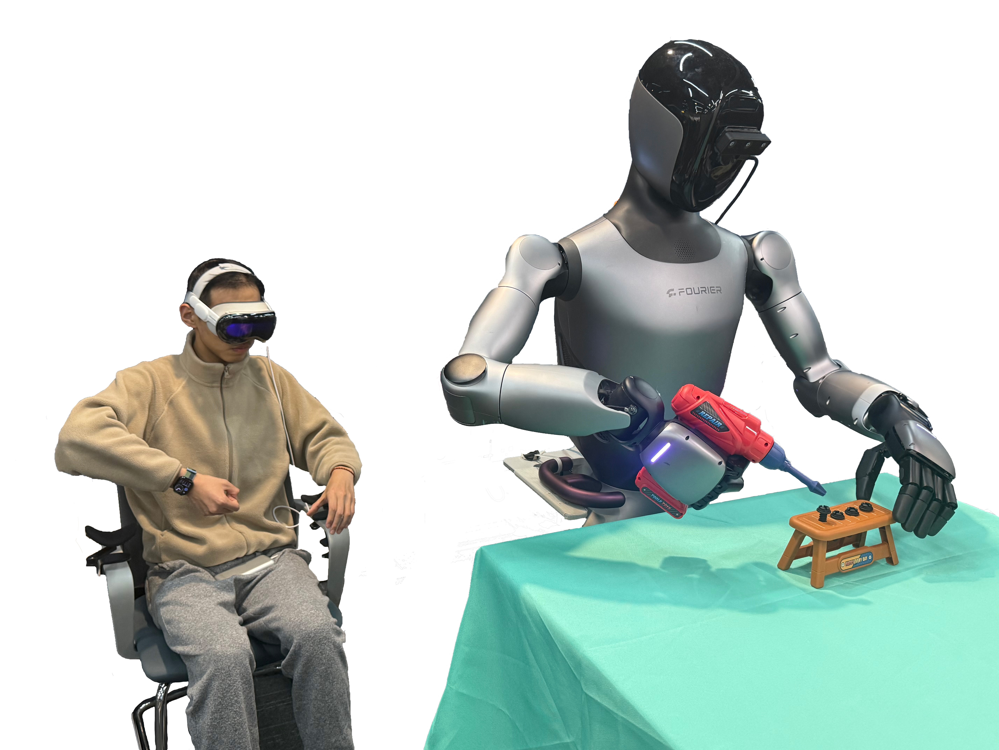
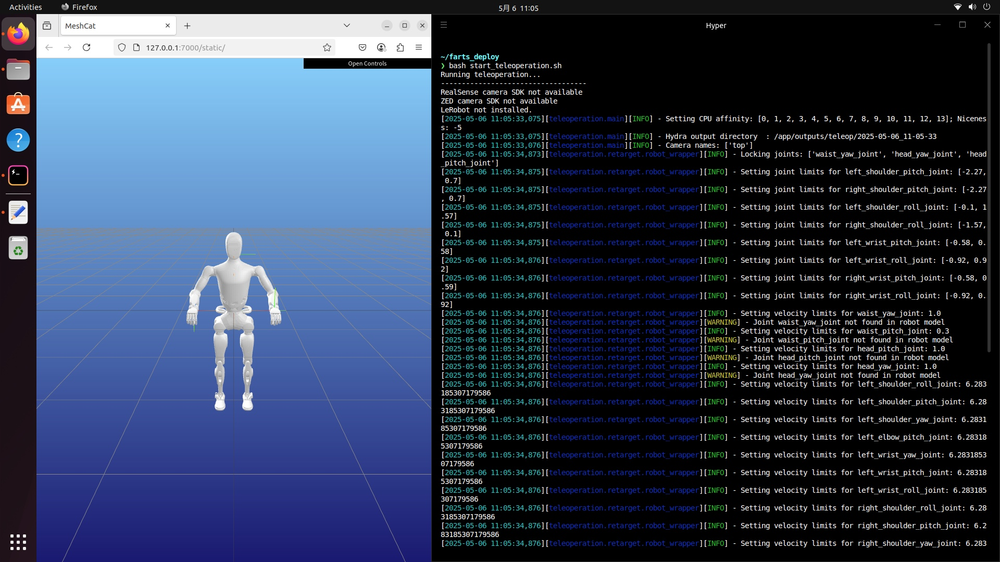

# 💨 teleoperation - A.K.A. Fourier Advanced Robot Teleoperation System (F.A.R.T.S.)




Welcome to `teleoperation`, the Fourier Advanced Robot Teleoperation System (F.A.R.T.S.)! This system enables real-time humanoid robot control using a VR headset and hand tracking. While primarily designed for Fourier GRX series robots, it's adaptable for other robots too. It supports various cameras like Depthai Oak, Intel RealSense, and generic USB cameras, and includes data collection features for imitation learning and VLA.

## 🗺️ Roadmap

- [] Add more documentation for the data collection and docker installation.
- [] Support Fourier 12 DOFhand with tactile sensors.
- [] Add tutorial for adding new emobiments.
- [] Switch to structured configs.

## 🛍 Prerequisites

### 🔧 Hardware Requirements

- **Robot**: Fourier GRX series robots (GR1T1, GR1T2, GR2.)
- **Dexterous Hand**: Fourier 6 DOF dexterous hand, Fourier 12 DOF dexterous hand, or Inspire hand.
- **Camera**: Depthai Oak, Intel RealSense D435, or generic USB camera.
- **VR Headset**: Apple Vision Pro or Meta Quest 3.
- **Host Computer**: Ubuntu 20.04 or later with a decent CPU.
- **Network**: Ensure the host computer and VR headset are on the same network. If you are using Apple Vision Pro, you need a **stable Wi-Fi connection**. If you are using Meta Quest 3, you can use a USB-C cable to connect the headset to the host computer.

> [!IMPORTANT]
> For other hardware related issues, especially if your are setting up the robot for the first time, we stringly encourage you to contact Fourier support team for help first.
> Setting up the robot and dealing with the quirks of each generation of Fourier robots can be a bit tricky, and they are out of the scope of this tutorial.
> For the rest of the tutorial, we will assume you are moderately familiar with the hardware setup and the robot is already set up and working properly.

### 👓 VR Headsets Setup

#### [VisionPro](https://www.apple.com/vision-pro/)

Apple restricts WebXR access on non-HTTPS connections. To test the application locally, you need to set up a self-signed certificate and install it on the client device.

> [!NOTE]
> Please ensure that both the VisionPro and the Ubuntu machine are on the same network.

1. **Enable WebXR related features in Safari**: Make sure you have the latest version of VisionOS installed on your VisionPro device. Then go to Safarai advanced settings `Settings > Apps > Safari > Advanced > Feature Flags` and enable the WebXR related features, they may be named differently in different versions of VisionOS.

2. **Install a Self-Signed Certificate**: We'll be using `mkcert` to create a self-signed certificate. and `mkcert` is a simple tool for making locally-trusted development certificates. It requires no configuration. Here's how to set it up:

   1. Please follow the instructions on the [official website](https://github.com/FiloSottile/mkcert) to install `mkcert`.

   2. Creating the certificate with `mkcert`, make sure to put the IP address of your computer in the command

    ```bash
    mkcert -install && mkcert -cert-file cert.pem -key-file key.pem {Your IP address} localhost 127.0.0.1
    ```

    > [!IMPORTANT]
    > Make sure to replace `{Your IP address}` with the actual IP address of your Ubuntu machine. You can find your IP address by running `ifconfig` in the terminal. The IP address is usually in the format `192.168.x.x` or `10.0.x.x`.

    > [!TIP]
    > For Ubuntu machines, you can use the zeroconf address instead of the IP address for additional convenience. The zeroconf address is usually `$(hostname).local`. You can find it by running `echo "$(hostname).local"` in the terminal.

   3. Firewall settings

      ```bash
      sudo iptables -A INPUT -p tcp --dport 8012 -j ACCEPT
      sudo iptables-save
      sudo iptables -L
      ```

        or setup firewall with `ufw`

      ```bash
      sudo ufw allow 8012
      ```

   4. install ca-certificates on VisionPro

        ```bash
        mkcert -CAROOT
        ```

        Copy the `rootCA.pem` file to the VisionPro device through the Airdrop. Alternatively, you can zip the file and start a local server on your Ubuntu machine and download the file from the VisionPro device.

        Settings > General > About > Certificate Trust Settings. Under "Enable full trust for root certificates", turn on trust for the certificate.


   5. Place `key.pem` and `cert.pem` into the `certs` folder to make sure the certificates are accessible by scripts.


#### [Meta Quest](https://www.meta.com/quest/)

1. Enable developer mode on the Meta Quest device following the [official instructions](](https://developers.meta.com/horizon/documentation/native/android/mobile-device-setup/)).

2. Install [adb](https://developer.android.com/studio/command-line/adb) on your host machine (We are assuming you are using Ubuntu). You can install adb with the following command:
    ```bash
    sudo apt install android-tools-adb
    ```

    Then launch the adb server with

    ```bash
    adb start-server
    ```
3. Connect the Meta Quest device to your computer using a USB-C cable. Allow USB debugging when prompted on the device.
4. Before running the program every time, forward the port with the following command:
    ```bash
    adb reverse tcp:8012 tcp:8012
    ```

### 📷 Camera Drivers Setup

> [!NOTE]
> Only realsense D435 and oak-d-w-97 are extensively tested. If you are using other cameras, you may need to modify some configs.

#### DepthAI Oak Camera

Install the DepthAI library with the following command:
```bash
sudo wget -qO- https://docs.luxonis.com/install_dependencies.sh | bash
```

> [!NOTE]
> Please make sure to update the `oak_multi.yaml` file with the serial numbers of each camera if you are using the multi-camera setup.

#### Intel RealSense Camera

Install the librealsense library following the [official instructions](https://github.com/IntelRealSense/librealsense/blob/master/doc/distribution_linux.md#installing-the-packages)

> [!NOTE]
> Please make sure to update the `realsense_multi.yaml` or `realsense.yaml` file with the serial numbers of each camera.

#### ZED Camera

Install the ZED SDK following the [official instructions](docs/zed_installation.md).


### 📐 GR1T1/T2 Calibration

`FARTS` supports multiple versions of SDKs for Fourier robots.
If you are using GR1T1 ir GR1T2 robot, we recommend the `grx` backend for now. While it is being phasing out in favor of the `hardware` backend, it is still the most stable and well-tested version.

The recommended setup is to use the `grx` backend is through the docker container. We provide a convenient script to run the docker container with the `grx` backend. You can run the following command to start the docker container:

```bash
cd ./server_config # You need to be in the server_config directory for the directory to be mounted correctly to the docker container
./run_server.sh gr1t1
```

This will mount the `server_config` directory to the docker container and start the GRX server. You can also use the `gr1t2` or `gr1t2` as the argument to run the docker container with different robot versions.

> [!IMPORTANT]
> If this is the first time you are running the `grx` backend, you need to calibrate the robot first. You can do this by running the following command in another terminal once the `grx` docker container is running and you have put the robot in its initial position:
> ```bash
>./scripts/grx_calibrate.sh
> ```
> This script will trigger the calibration process and save the calibration data to the `sensor_offset.json` file in the `server_config` directory.
> Once the calibration script is finished, you can terminate the `grx` docker container and start it again. This will make sure the calibration is correctly loaded.


## 🚀 Getting Started

First, clone the repo:

```bash
git clone https://github.com/FFTAI/teleoperation.git
```

We use [uv](https://docs.astral.sh/uv/) to manage our dependencies, ([and you should too](https://github.com/astral-sh/uv/blob/main/BENCHMARKS.md)). You can follow the [official instruction](https://docs.astral.sh/uv/getting-started/installation/) to install `uv` on your machine.

Then, you can create a new virtual environment with the following command:

```bash
# create a 3.11 virtual environment using uv
uv venv -p 3.11
```

or if you want to use conda to manage your python versions, you can:

```bash
# create a 3.11 virtual environment using conda
conda create -n teleop python=3.11 ffmpeg==7.1.1
conda activate teleop
uv venv -p $(which python)
```

Then, you can install the dependencies with the following command:

```bash
# resolve the dependencies
uv sync --extra depthai # if you are using Oak camera
# OR
uv sync --extra realsense # if you are using realsense camera
# activate the virtual environment
source .venv/bin/activate
```

Then you can try to run the demo script with the following command:

> [!TIP]
> If you are on Ubuntu 22.04 or later, we recommend using the [Hyper terminal](https://hyper.is/) or the built-in terminal of VSCode to run the script. This is because the `pynput` library has some limitations on Wayland, which may cause issues when monitoring keyboard events.

```bash
# if you are using Apple Vision Pro:
python -m teleoperation --config-name teleop robot=gr1t1_legacy hand=fourier_dexpilot_dhx camera=oak_97 robot.visualize=true mocap=avp sim=true

# OR if you are using Meta Quest 3
python -m teleoperation --config-name teleop robot=gr1t1_legacy hand=fourier_dexpilot_dhx camera=oak_97 robot.visualize=true mocap=quest sim=true
```

Then you can see a visualization of the robot if you go to `http://127.0.0.1:7000/static/` on your host machine.



In the browser on your headset, go to `https://your-hostname.local:8012?ws=wss://your-hostname.local:8012` if you are using Apple Vision Pro.
Or `http://localhost:8012?ws=ws://localhost:8012` if you are using Meta Quest 3. Then you  should be able to see the camera image on the browser page.
Finally, Click the `Enter VR` button on the web page and give necessary permissions to start the VR session.

If your hands appear not aligned in the visualization，you can reset the Vision Pro tracking by long pressing the crown button on the Vision Pro device until you hear a ding sound.


## 🕹️ Usage

### 🕹️ Teleoperation

We manage the config with [Hydra](https://hydra.cc/docs/intro/). You can select config files and override with hydra's [override syntax](https://hydra.cc/docs/advanced/override_grammar/basic/).
By default, the script uses the `teleop` config file and you must specify the hand, camera, and robot configs to use.

```bash
python -m teleoperation --config-name teleop robot=??? hand=??? camera=??? robot.visualize=true mocap=avp
```
The available options for the `robot`, `hand`, and `camera` parameters are listed below:

- **robot**:
  - `gr1t1_legacy`: gr1t1 robot with legacy `grx` SDK
  - `gr1t2_legacy`: gr1t2 robot with legacy `grx` SDK
  - `gr2_hardware`: gr2 robot with the new experimental SDK
- **hand**:
  - `fourier_dexpilot_dhx`: Fourier 6 DOF dexterous hand
  - `fourier_12dof_dexpilot`: Fourier 12 DOF dexterous hand
  - `inspire_dexpilot`: Inspire hand
- **camera**:
  - `oak_97`: Depthai Oak-D-W-97 camera
  - `realsense`: Intel RealSense D435 camera, you need to specify the serial number in the config file
  - `realsense_multi`: Intel RealSense D435 multi-camera setup
  - `opencv`: Generic USB camera with OpenCV, you need to specify the port by adding `camera=opencv camera.instance.port=/dev/video0` to the command line.

Some other usefaul options are:
- `robot.visualize`: Whether to visualize the robot in the browser. Default is `false`.
- `mocap`: The type of motion capture system to use. Options are `avp` for Apple Vision Pro and `quest` for Meta Quest 3. Default is `avp`.
- `sim`: Whether to run the simulation mode. Default is `false`. If you are using the real robot, please set this to `false`. If you are using the simulation mode, please set this to `true`.
- `debug_hand`: Whether to visualize the hand tracking data in the browser. Default is `false`.
- `use_depth`: Whether to collect depth data. Default is `false`.
- `use_head`: Whether to enable head tracking. Default is `false`. If this is set to `true`, the robot will mimic the head movements of the operator. This is useful for applications where the operator needs to look around while teleoperating the robot.
- `use_waist`: Whether to enable waist tracking. Default is `false`. If this is set to `true`, the robot will mimic the waist movements of the operator.
    > [!CAUTION]
    > **Please make sure that your robot is properly calibrated, and all pins are taken out before running the script. Otherwise, this could damage the robot or result in unexpected behavior. Please contact the Fourier support team for more details if you plan to use it.**
- `gravity_compensation`: Whether to enable gravity compensation. Default is `false`. If this is set to `true`, the robot will compensate for the gravity when moving.
    > [!CAUTION]
    > **This is an experimental feature and is very sensitive to network latency. Please contact the Fourier support team for more details if you plan to use it.**


> [!TIP]
> You can check the config in the `configs` directory for more details. There are several examples for how to use other cameras and robots.


### 🏭 Data Collection

To record data, use the daq config file and specify the task name, the syntax is the same as the teleoperation config file but using different config file:

```bash
python -m teleoperation --config-name daq robot=gr1t2_legacy camera=oak task_name=${task_name}
```

For more config options, please refer to the `configs/daq.yaml` file or see the `scripts/data_collection.sh` file.

> [!CAUTION]
> If you are using the real robot, please make sure to leave enough empty space around the robot before starting the script, as the robot will move to its start position automatically.


### Starting the teleoperation/data collection

We recommend doing the teleoperation, especially the data collection, with two people. One person is the pilot who wears the VR headset and controls the robot, and the other person is the operator who monitors the robot's position and helps the pilot to start the teleoperation.

After launching the program, you can open the browser on the Apple VisionPro device and go to `https://your-hostname.local:8012?ws=wss://your-hostname.local:8012`, or `http://localhost:8012?ws=ws://localhost:8012` if you are using Meta Quest 3.
If you already in this website, you can refresh the page and click until see the camera image in the VR session.
Then click the `Enter VR` button and give necessary permissions to start the VR session. Make sure to reset the Vision Pro tracking by long press the crown button on the Vision Pro device until you hear a sound.

The VR session will show the FOV camera image in the headset. At this time the pilot is not yet engaged in the teleoperation.
The pilot should put their hands in the same start position as the robot, and then ask the operator to hit the `Space` key on the host machine to start the teleoperation.
It is a good practice to also ask the operator to check the robot's position in the browser visualization to make sure the robot is in the same position as the pilot's hands.

Afterwards, the pilot can start the teleoperation by moving their hands in the VR session. The robot will follow the pilot's hand movements in real-time.

To stop the teleoperation, the operator can hit the `Space` key again or just `ctrl+c` the script in the terminal.

For data collection, the process is largely the same. After hitting the `Space` key, for the first time to engage the teleoperation, the operator can hit the `Space` key again to start the data collection.
When the data collection is started, the pilot should see a red dot in their VR session. This indicates that the data collection is in progress.
The operator can then hit the `Space` key again to stop the data collection, or `x` key to discard the current episode.
The data will be saved in the `data` directory with the task name specified in the command line.å

***You may watch the video to see how to access the VR session inside the VisionPro device: [VisionPro operation video](./figure/video/Vp.mp4)***

## 📦 Docker Installation

TODO

## 🛠️ Development

TODO


## ❓ FAQ
### You see the message "Your connection is not secure" when you open the browser on VisionPro
This is because we are using a self-signed certificate. Click "Advanced" and then "proceed to website". You will be prompted to accept the certificate.

### THe keyboard input is not working or you get `AttributeError: record_create_context` when you run the script

This is due to limitations of the `pynput` library. Because Ubuntu 22.04 and later has switched to Wayland, which poses more restrictions on monitoring keyboard events.
These issues usualy arise when you are either running the script over SSHor a pure wayland terminal.
To resolve this, the easiest solution is to run the script in a terminal that supports X11. Like the built-in terminal of VSCode or the [Hyper terminal](https://hyper.is/), which we internally use.

We are working on a solution to switch to a `evdev` based solution.

### How to reset Apple Vision Pro tracking

To reset the tracking, long press the crown button on the Vision Pro device until you hear a sound. This will reset the tracking origin to the current position of the device.

## 🙏 Credits

This project is based on the amazing [OpenTeleVision](https://github.com/OpenTeleVision/TeleVision) project. We would like to thank the original authors for their contributions.

## 📖 Citation

If you find this project useful, please consider citing it:

```bibtex
@misc{teleoperation,
  author = {Yuxiang Gao, Shuo Hu, Fourier Co Ltd},
  title = {teleoperation},
  year = {2024},
  publisher = {GitHub},
  journal = {GitHub repository},
  howpublished = {\url{https://github.com/FFTAI/teleoperation}}
}
```
